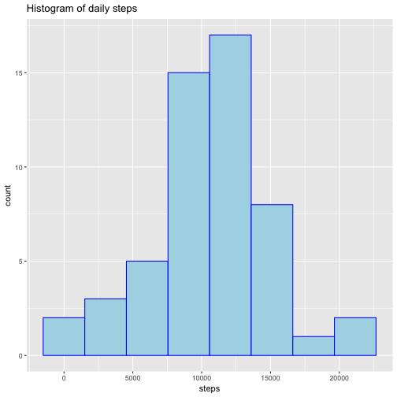
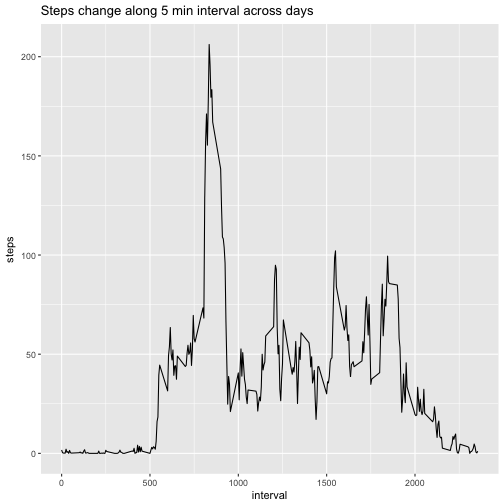
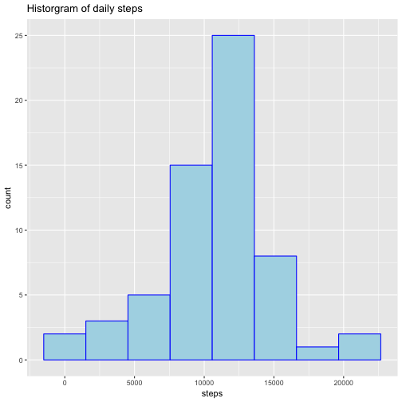
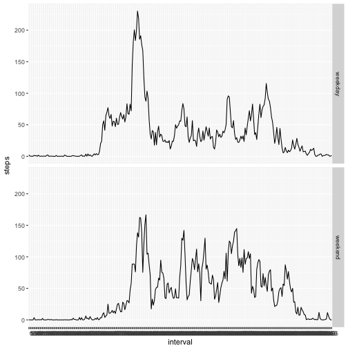

# Reproducible Research Week 2 Assignment  
## Loading and preprocessing the data
  1. download [file] (https://d396qusza40orc.cloudfront.net/repdata%2Fdata%2Factivity.zip) 
  and unzip file  
  2. transform the data into .csv


## What is mean total number of steps taken per day?  
  1. Calculate total steps per day  

```r
library(data.table)
DailySum <- as.data.table(data)[, sum(steps), by = .(date)]
colnames(DailySum) <- c("date", "steps")
DailySum$steps <- as.numeric(DailySum$steps)
head(DailySum)
```

```
##          date steps
## 1: 2012-10-01    NA
## 2: 2012-10-02   126
## 3: 2012-10-03 11352
## 4: 2012-10-04 12116
## 5: 2012-10-05 13294
## 6: 2012-10-06 15420
```

  2. plotting the histogram of total steps per day; here assign the bins to 8  

```r
library(ggplot2)
g <- ggplot(DailySum, aes(x = steps))
g + geom_histogram(na.rm = TRUE, bins = 8, fill = "lightblue", color = "blue")+labs(title = "Histogram of daily steps")
```



  3. take a look at the summary of steps

```r
summary(DailySum)
```

```
##      date               steps      
##  Length:61          Min.   :   41  
##  Class :character   1st Qu.: 8841  
##  Mode  :character   Median :10765  
##                     Mean   :10766  
##                     3rd Qu.:13294  
##                     Max.   :21194  
##                     NA's   :8
```
from the summary table, the mean is 10766, median is 10765

## What is the average daily activity pattern?
  1. calcaulate mean steps of each time interval across all days  

```r
DailyAver <- as.data.table(data)[, mean(steps, na.rm = TRUE), by = .(interval)]
colnames(DailyAver)[2] <- "steps"
head(DailyAver)
```

```
##    interval     steps
## 1:        0 1.7169811
## 2:        5 0.3396226
## 3:       10 0.1320755
## 4:       15 0.1509434
## 5:       20 0.0754717
## 6:       25 2.0943396
```
  2. plot the steps change along time interval

```r
g2 <- ggplot(DailyAver, aes(interval, steps))
g2 + geom_line() + labs(title = "Steps change along 5 min interval across days")
```


  3. find out which 5-min interbal contains the maximum number of steps

```r
DailyAver[which.max(DailyAver$steps),]
```

```
##    interval    steps
## 1:      835 206.1698
```

## Imputing missing values  
  1. calculate and report the total number of missing values  

```r
sum(is.na(data))
```

```
## [1] 2304
```
  2. filling the missing value. here mean of 5-min interval was assigned to corresponding missing value.
  new dataset with filled missing value is called "Inser2"  

```r
Inser <- cbind(data, DailyAver[,2])
NA2aver <- function(x) { 
  if (is.na(x[1])) {
    x[1] = x[4]
  }
  x}
Inser2 <- apply(Inser, 1, NA2aver)
Inser2 <- t(Inser2)
colnames(Inser2) <- c("steps", "date", "interval", "average_steps")
Inser2 <- as.data.frame(Inser2, stringsAsFactors = FALSE)
Inser2$steps <- as.numeric(Inser2$steps)
head(Inser2)
```

```
##       steps       date interval average_steps
## 1 1.7169811 2012-10-01        0     1.7169811
## 2 0.3396226 2012-10-01        5     0.3396226
## 3 0.1320755 2012-10-01       10     0.1320755
## 4 0.1509434 2012-10-01       15     0.1509434
## 5 0.0754717 2012-10-01       20     0.0754717
## 6 2.0943396 2012-10-01       25     2.0943396
```
  3. calculate daily steps to a new dataset "Inser_sum" and make a historgram  

```r
Inser_sum <- as.data.table(Inser2)[, sum(steps), by = .(date)]
ggplot(Inser_sum, aes(x = V1)) + geom_histogram(bins = 8, fill = "lightblue", color = "blue")+ labs(x = "steps", title = "Historgram of daily steps")
```


  4. take a look at mean and median value of new dataset

```r
summary(Inser_sum$V1)
```

```
##    Min. 1st Qu.  Median    Mean 3rd Qu.    Max. 
##      41    9819   10766   10766   12811   21194
```
from the summary, we can see the mean is 10766, median is 10766. Inserted missing value moved the median value a little bit  
##Are there differences in activity patterns between weekdays and weekends?  
  1. create a new factor to indicate "weekday" or "weekend"  

```r
Inser2$average_steps <- NULL
library(lubridate)
Inser2$weektype <- ifelse(wday(Inser$date) %in% c(1, 7), "weekend", "weekday")
```
  2. summarize a new dataset based on steps per time interval categorized by weekday/weekend  

```r
Final <- as.data.table(Inser2)[, mean(steps), by = .(interval, weektype)]
colnames(Final)[3] <- "steps"
head(Final)
```

```
##    interval weektype      steps
## 1:        0  weekday 2.25115304
## 2:        5  weekday 0.44528301
## 3:       10  weekday 0.17316562
## 4:       15  weekday 0.19790356
## 5:       20  weekday 0.09895178
## 6:       25  weekday 1.59035639
```
  3. make a panel plot

```r
ggplot(Final, mapping = aes(x = interval, y = steps, group = 1)) + geom_line() + facet_grid(weektype ~.)
```


